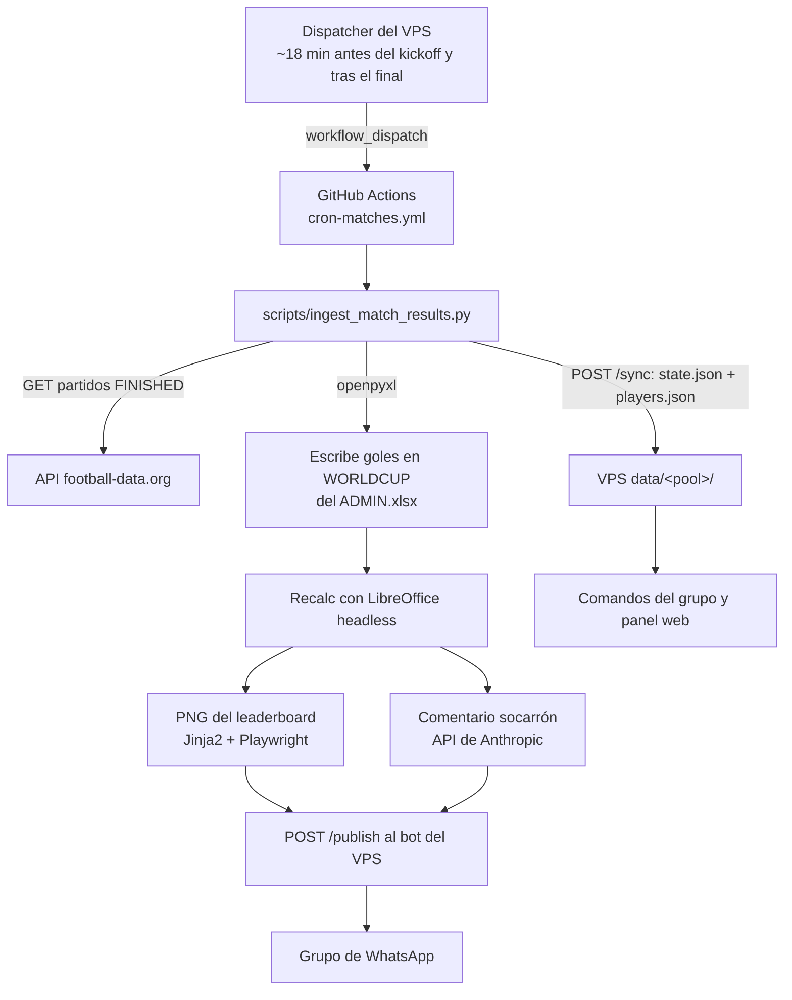

# Arquitectura

Filosofía: el Excel comercial hace toda la matemática de puntuación; el kit
automatiza todo lo demás. Sin base de datos, sin colas: el estado vive en el
repo (`ADMIN.xlsx` + `state.json`, commiteados por el cron tras cada partido)
y en el VPS solo hay copias sincronizadas para servir comandos y web.

## Flujo de un partido

Cada partido se procesa secuencialmente: snapshot del ranking ANTES → escribir
goles → recalc → snapshot DESPUÉS → delta de puntos por jugador → imagen +
comentario → publicar → marcar como anunciado en `state.json` (solo tras el
POST exitoso: si el VPS está caído, el siguiente run reintenta). El workflow
commitea ADMIN + state al final del job.

El disparo **no** depende del `schedule:` de GitHub (los retrasa o los salta):
el dispatcher del VPS lanza `workflow_dispatch` con un PAT
(`GH_DISPATCH_TOKEN`) según el calendario que recibe por `/sync`.

## Modelo multi-porra

N porras independientes comparten cron, bot, VPS y claves de API:

- Cada porra vive en `pools/<id>/` (ADMIN.xlsx, players.json, state.json).
- Una sola env var **`POOL_ID`** por job del workflow; los scripts derivan
  todos los paths de ella y fallan rápido si falta.
- Un secret **`WHATSAPP_GROUP_ID_<POOL>`** por porra; el workflow lo inyecta
  como `WHATSAPP_GROUP_ID` en el job correspondiente.
- Los jobs van **secuenciales** (`needs:` + pausa de 30 s entre envíos): evita
  races de `git push` y ráfagas de mensajes al mismo número (riesgo de ban).
- Recursos **comunes** (no duplicar): `data/*.json` (mapeos de equipos,
  partido→fila), todos los `scripts/lib_*.py`, `design/`, `vps/`. El bot es
  agnóstico al pool: recibe el `group_id` en el body de cada POST.

## Piezas

### Python (`scripts/`)

| Módulo | Qué hace |
|---|---|
| `lib_excel.py` | Carga/guarda/desprotege los Excel con openpyxl y fuerza el recálculo vía LibreOffice headless. |
| `lib_football_api.py` | Cliente de football-data.org con reintentos/backoff y partido sintético en DRY_RUN. |
| `lib_scoring.py` | Lectores de WORLDCUP/CLAS + re-cálculo independiente de puntos ("marcador en la sombra") para la auditoría. |
| `lib_screenshot.py` | Renderiza el leaderboard como PNG: plantilla Jinja2 + Chromium headless (Playwright). |
| `lib_claude.py` | Comentario del partido con la API de Anthropic: prompt caching del system (tono + perfiles) y anti-alucinación (todas las cifras van en el prompt; la IA solo redacta). |
| `lib_whatsapp_client.py` | POST autenticado al VPS (`/publish`, `/sync`). |
| `ingest_match_results.py` | Orquestador del cron (el flujo del diagrama). |
| `ingest_predictions.py` | Inyecta los Excel de los jugadores en el ADMIN (pre-torneo, idempotente). |
| `bootstrap_match_rows.py` / `set_scoring.py` | One-shots de arranque: mapa partido→fila y baremo de puntos. |
| `audit_pool.py` | Auditoría semanal de solo lectura: contrasta API ↔ Excel ↔ publicado. |
| `send_daily_leaderboard.py` / `send_poster.py` / `build_web_data.py` / `build_palmares.py` | Clasificación matinal, carteles puntuales, datos del panel web y palmarés de cierre. |

### Bot del VPS (`vps/server.js`)

Un único proceso Node.js: Express + whatsapp-web.js (sesión persistida en
disco; QR solo la primera vez).

- **Endpoints**: `POST /publish` (mensaje + imagen al grupo), `POST /sync`
  (recibe state/players por pool), `GET /health`, panel web bajo
  `GET /web/<slug-secreto>`.
- **Comandos de grupo**: `!ranking`, `!hoy` (puntos del día), `!proximo`,
  `!puntos`, `!soy <nombre>` (vincula tu número a un jugador),
  `!miprediccion`, `!mispuntos`, `!ayuda`.
- **`!claudio <texto>`** (alias `!bot`): chat con IA abierto al grupo, con
  contexto del pool (ranking, próximos partidos, predicciones), web search
  limitada a 1 uso por mensaje y **rate limit de 10 mensajes/24 h por
  persona** (el organizador, `ORGANIZER_JID`, queda exento).
- **Dispatcher**: temporizador interno que dispara el workflow de GitHub
  alrededor de cada kickoff (ver diagrama).

## Modo DRY_RUN

Toda la cadena respeta `DRY_RUN=1` (o `-f dry_run=true` en el workflow): la
API devuelve un partido falso, la IA responde un mock sin gastar tokens y el
cliente de WhatsApp imprime en vez de publicar. Permite probar el pipeline
completo de punta a punta sin molestar a nadie.

## Decisiones de seguridad

- **Auth del bot**: `Authorization: Bearer <token>` comparado con
  `crypto.timingSafeEqual` (constant-time, evita timing attacks).
- **Allowlist de grupos**: solo los chats mapeados en `POOL_GROUPS` reciben
  respuesta; el resto de mensajes se ignora en silencio.
- **Prompt-hardening del `!claudio`**: system prompt con reglas explícitas
  contra cambios de rol, input del usuario envuelto en etiquetas
  `<user_message>` para tratarlo como datos, respuesta truncada a 800
  caracteres antes de publicarse y rate limit por persona.
- **Sanitización en origen**: los nombres de jugador (vienen de Excels que
  envía cada participante) se filtran de caracteres de control y se truncan
  antes de inyectarse en cualquier prompt.
- **Sin secretos en el repo**: claves solo en GitHub Secrets y en el `.env`
  del VPS; las predicciones (`predictions/`) están gitignored.
